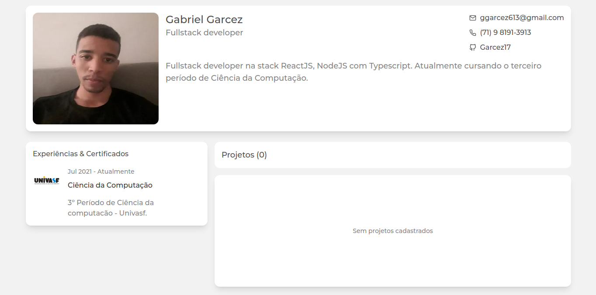

<h1 align="center">
  Portfolio - Gabriel Garcez
</h1>

<p align="center">
  
</p>

<p align="center">
  <a href="https://portfolio-garcez17.vercel.app/">Acessar site</a>
</p>

## Sobre o Projeto

Aplicação desenvolvida para apresentar meu portfólio pessoal, contendo projeto desenvolvidos 100% por mim, sejam clones, projetos proprios e ou incrementos de projetos produzidos em workshops.

Aplicação serverless, feita em ReactJS com NextJS, utilizando prismaORM com banco MySQL hospedado na PlanetScale.

## Funcionalidades

- [x] Layout totalmente responsivo, utilizando desenvolvimento baseado em Mobile First.

### Homepage

- [x] Listagem de projetos, experiências e certificados.

- [x] Informação de perfil pessoal.

### Dashboard

- [x] Login.

- [x] Criar, editar e excluir projetos.

- [x] Criar, editar e excluir experiências & certificados.

- [x] Criar, editar e excluir tags.

- [x] Edição de perfil pessoal.

## Próximas features

- [] Dark Theme.

- [] Tela de mais detalhes dos projetos.

- [] Filtro na listagem de projetos por tecnologia.

## Feito com:
- [ReactJS](https://github.com/facebook/react) - Biblioteca Javascript para construção de interfaces.
- [Next.js](https://github.com/vercel/next.js) - Framework React JS.
- [TailwindCSS](https://tailwindcss.com/) - Utility first framework para CSS.
- [Typescript](https://github.com/microsoft/TypeScript) - Supertset para Javascript.
- [React-modal](https://github.com/reactjs/react-modal) - Biblioteca para construção de modal.
- [React-hook-form](https://github.com/react-hook-form/react-hook-form) - Biblioteca para forulários.
- [Firebase](https://firebase.google.com/docs/auth?hl=pt-br) - Utilizado para criar o sistema de autenticação da aplicação.
- [AWS](https://aws.amazon.com/pt/s3/) - Utilizado o serviço da S3 para armazenamento das imagens da aplicação.
- [Material UI](https://mui.com/pt/) - Utilizado apenas para input de autocomplete nas tags.

## Como executar

```
$ git clone https://github.com/Garcez17/Portfolio
$ cd Porfolio
$ yarn
$ yarn dev
```

## Licença

Esse projeto está sob a licença MIT. Veja o arquivo [LICENSE](https://github.com/Garcez17/Portfolio/blob/main/LICENSE) para mais detalhes.
